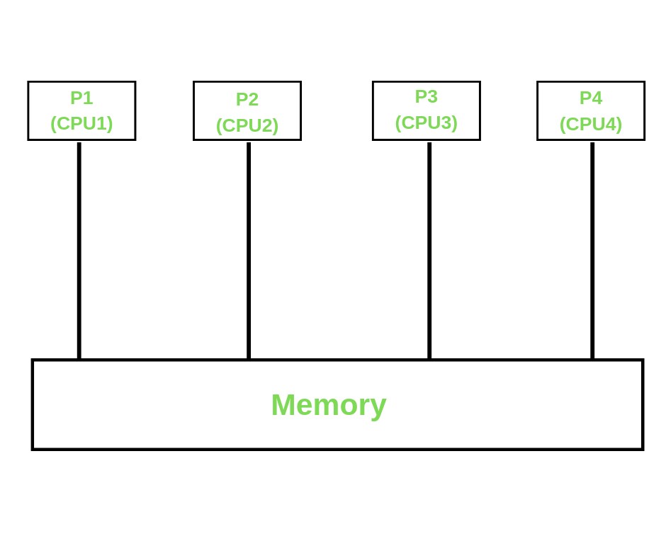
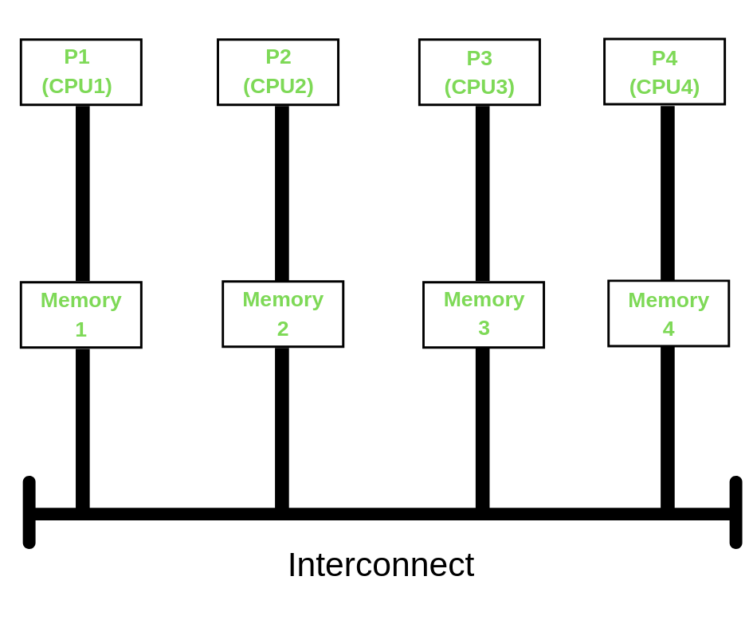
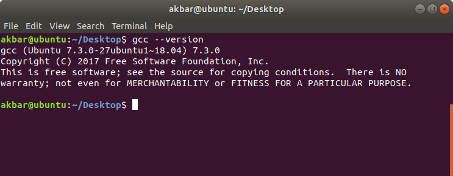
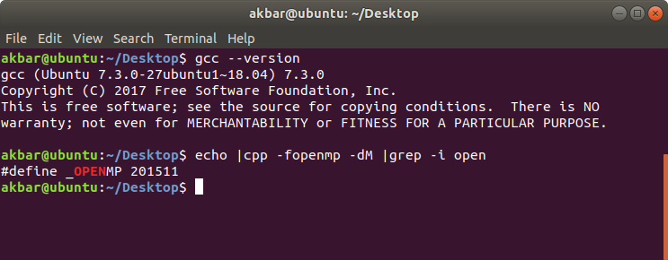
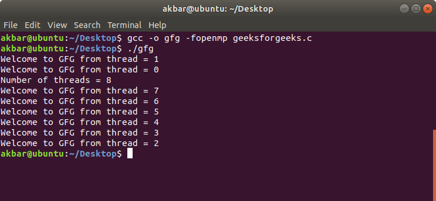
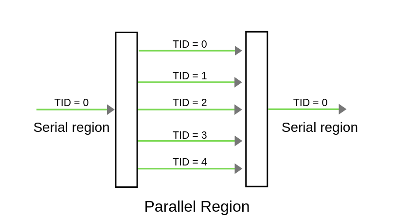
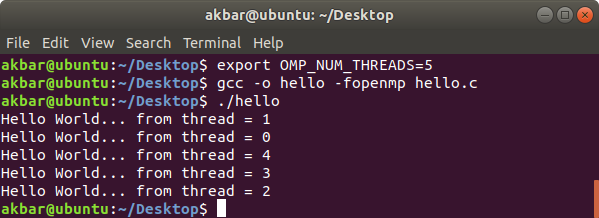
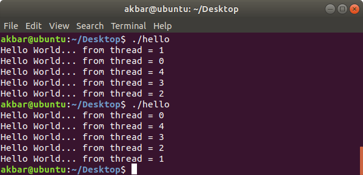

# Open Multi-processing (OpenMP)

## Introduction with Installation Guide

After a long thirst for parallelizing highly regular loops in matrix-oriented numerical
programming, OpenMP was introduced by OpenMP Architecture Review Board (ARB) on 1997.
In the subsequent releases, the enthusiastic OpenMP team added many features to it
including the task parallelizing, support for accelerators, user-defined reductions
and lot more.
The latest OpenMP 5.0 release was made in 2018 November.

Open Multi-processing (OpenMP) is a technique of parallelizing a section(s) of
C/C++/Fortran code.
OpenMP is also seen as an extension to C/C++/Fortran languages by adding the
parallelizing features to them.
In general, OpenMP uses a portable, scalable model that gives programmers a simple and
flexible interface for developing parallel applications for platforms that ranges from
the normal desktop computer to the high-end supercomputers.

### THREAD Vs PROCESS

A process is created by the OS to execute a program with given resources(memory,
registers); generally, different processes do not share their memory with another.
A thread is a subset of a process, and it shares the resources of its parent process but
has its own stack to keep track of function calls.
Multiple threads of a process will have access to the same memory.

### Parallel Memory Architectures

Before getting deep into OpenMP, let’s revive the basic parallel memory architectures.
These are divided into three categories;

- Shared memory:

  

  OpenMP comes under the shared memory concept.
  In this, different CPU’s (processors) will have access to the same memory location.
  Since all CPU’s connect to the same memory, memory access should be handled carefully.

- Distributed memory:

  

  Here, each CPU(processor) will have its own memory location to access and use.
  In order to make them communicate, all independent systems will be connected together using
  a network.
  MPI is based on distributed architecture.

- Hybrid:
  Hybrid is a combination of both shared and distributed architectures.
  A simple scenario to showcase the power of OpenMP would be comparing the execution time of
  a normal C/C++ program and the OpenMP program.
  
### Steps for Installation of OpenMP

STEP 1: Check the GCC version of the compiler

``` 
gcc --version
```

GCC provides support for OpenMP starting from its version 4.2.0.
So if the system has GCC compiler with the version higher than 4.2.0, then it must have
OpenMP features configured with it.



If the system doesn’t have the GCC compiler, we can use the following command:

```
sudo apt install gcc
```

For more detailed support for installation, we can refer here

STEP 2: Configuring OpenMP

We can check whether the OpenMP features are configured into our compiler or not, using
the command:

```
echo |cpp -fopenmp -dM |grep -i open
```



If OpenMP is not featured in the compiler, we can configure it use using the command:

```
sudo apt install libomp-dev
```

STEP 3: Setting the number of threads

In OpenMP, Before running the code, we can initialise the number of threads to be executed
using the following command.
Here, we set the number of threads to be getting executed to be 8 threads.

```
export OMP_NUM_THREADS=8
```

### Running First Code in OpenMP

```
// OpenMP header 
#include <omp.h> 
#include <stdio.h> 
#include <stdlib.h> 

int main (int argc, char* argv[]) 
{ 
	int nthreads, tid; 

	// Begin of parallel region 
	#pragma omp parallel private(nthreads, tid) 
	{ 
		// Getting thread number 
		tid = omp_get_thread_num (); 
		printf ("Welcome to GFG from thread = %d\n", 
			tid); 

		if (tid == 0)
    { 
			// Only master thread does this 
			nthreads = omp_get_num_threads (); 
			printf ("Number of threads = %d\n", 
				nthreads); 
		} 
	} 
} 
```

Output:



This program will print a message which will be getting executed by various threads.

Compile:

```
gcc -o gfg -fopenmp geeksforgeeks.c
```

Execute:

```
./gfg
```

## Hello World program

In C/C++/Fortran, parallel programming can be achieved using OpenMP.
In this article, we will learn how to create a parallel Hello World Program using OpenMP.

### Steps to create a parallel program

1. Include the header file:

   We have to include the OpenMP header for our program along with the standard header files.

   ```
   //OpenMP header
   #include <omp.h>
   ```

2. Specify the parallel region: In OpenMP, we need to mention the region which we are going to
   make it as parallel using the keyword pragma omp parallel.
   The pragma omp parallel is used to fork additional threads to carry out the work enclosed
   in the parallel.
   The original thread will be denoted as the master thread with thread ID 0.
   Code for creating a parallel region would be,

   ```
   #pragma omp parallel
   {
     //Parallel region code 
   } 
   ```

   So, here we include:

   ```
   #pragma omp parallel                   
   {
       printf("Hello World... from thread = %d\n", 
              omp_get_thread_num());
   }
   ```

3. Set the number of threads:
   we can set the number of threads to execute the program using the external variable.

   ```
   export OMP_NUM_THREADS=5
   ```

   Diagram of parallel region

   

   As per the above figure, Once the compiler encounters the parallel regions code,
   the master thread(thread which has thread id 0) will fork into the specified number
   of threads.
   Here it will get forked into 5 threads because we will initialise the number of threads
   to be executed as 5, using the command export OMP_NUM_THREADS=5.
   Entire code within the parallel region will be executed by all threads concurrently.
   Once the parallel region ended, all threads will get merged into the master thread.

4. Compile and Run:

   Compile:

   ```
   gcc -o hello -fopenmp hello.c
   ```
 
    Execute:

   ```
   ./hello
   ```

The directory src contains the complete program with the output of the above approach:

Program: Since we specified the number of threads to be executed as 5, 5 threads will
execute the same print statement at the same point of time.
Here we can’t assure the order of execution of threads, i.e Order of statement
execution in the parallel region won’t be the same for all executions.
In the below picture, while executing the program for first-time thread 1 gets completed
first whereas, in the second run, thread 0 completed first.
omp_get_thread_num() will return the thread number associated with the thread.

Output:

When run for 1st time:



When run for multiple time:

Order of execution of threads changes every time.



